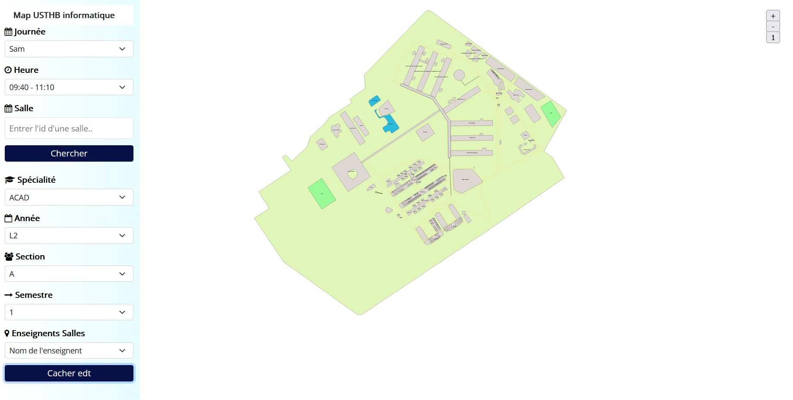
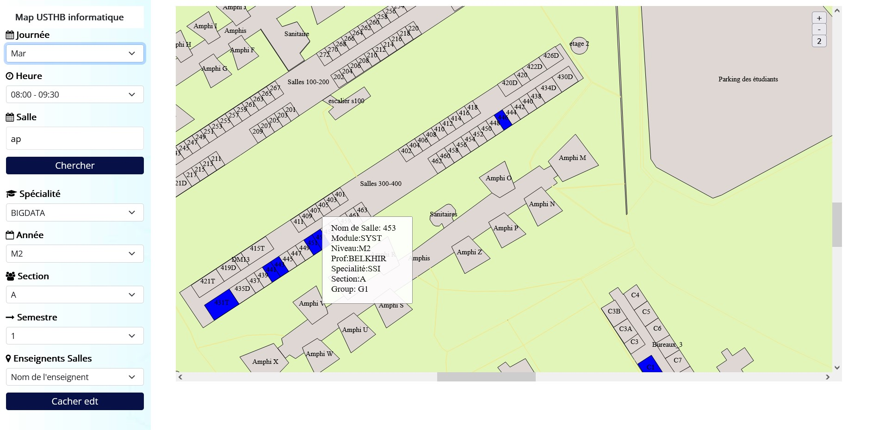
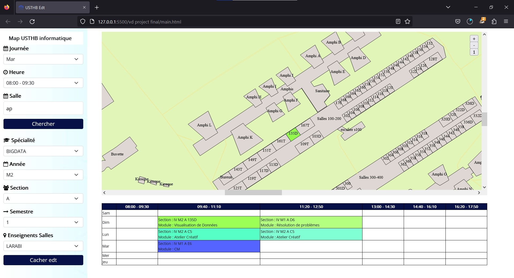
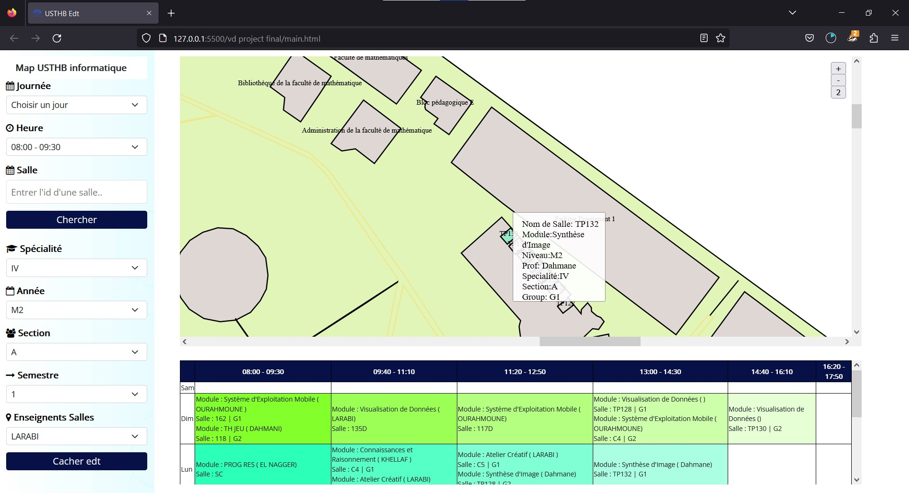

## link of our project that is published in a magazine for computer vision
https://perso.usthb.dz/~slarabi/VisualComputingMagazine.html

# USTHB_University-Master-Schedules-visualization
The aim of this project is to visualize the activities of the Computer Science Faculty on the USTHB campus by creating an interactive map of the university. This map will display information about the utilization of various rooms and facilities by computer science students.
With this project, users will be able to interactively explore the activities of the Computer Science Faculty on the USTHB campus. They can view room occupancy, instructor schedules, and events at various times and dates, providing a valuable resource for students, staff, and administrators to plan their activities
effectively.

## Some images

